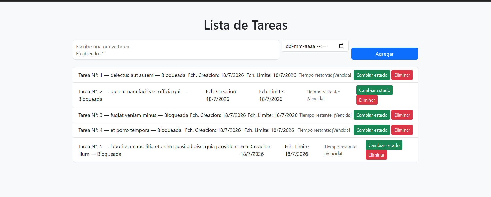
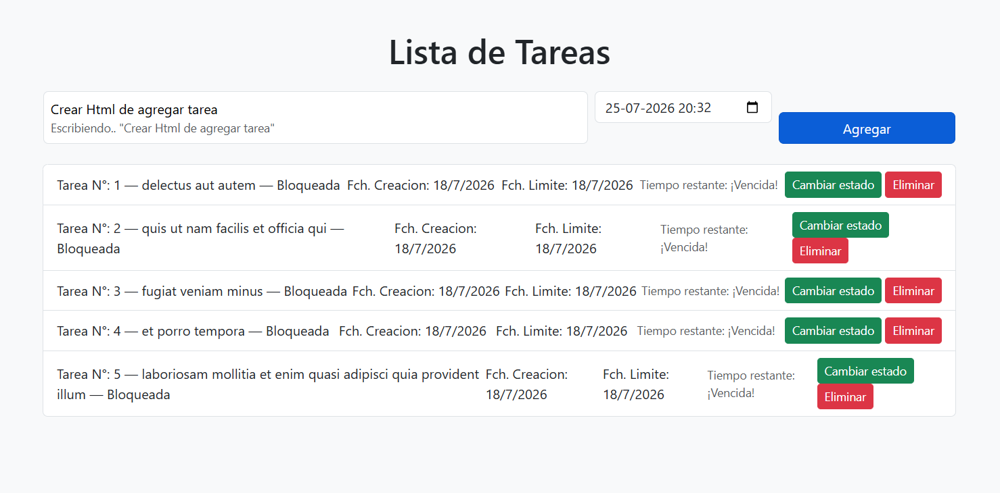
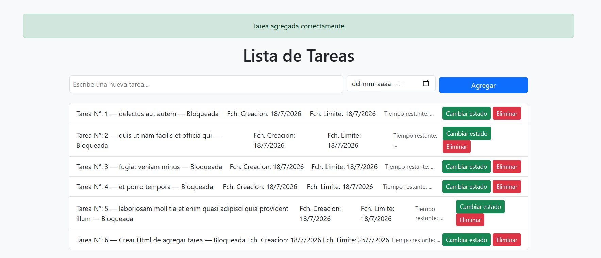
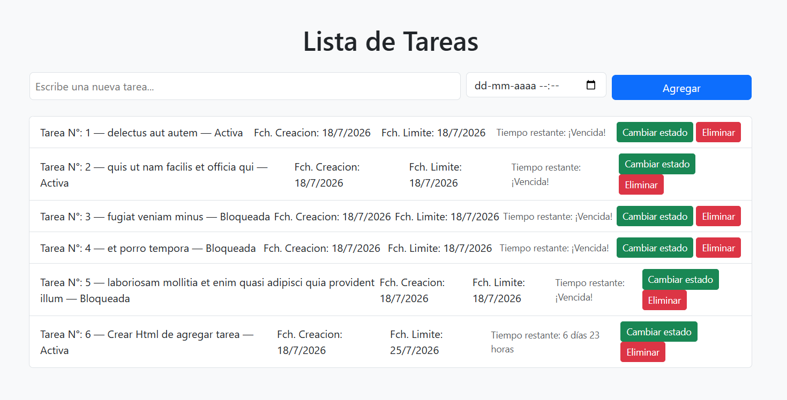
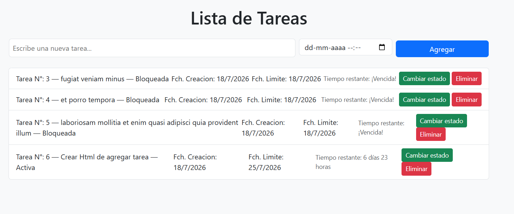

# Lista de tareas — Aplicación de Gestión de Tareas en JavaScript

**Autor:** Diego Navarrete — Sección 2

Proyecto final del Módulo 4: **Programación Avanzada en JavaScript**.

Aplicación web para crear, editar y eliminar tareas, usando JavaScript moderno (POO, ES6+, eventos del DOM, asincronía y consumo de APIs), con Bootstrap para los estilos.

## 🚀 Cómo ejecutar el proyecto

1. Descargar o clonar este repositorio.
2. Abrir la carpeta en Visual Studio Code.
3. Abrir `index.html` con la extensión **Live Server** (el proyecto usa módulos JS con `import`/`export`, que necesitan un servidor local para funcionar).

> ⚠️ No abrir `index.html` directo con doble clic, porque los módulos no van a cargar.

## 🗂️ Estructura del proyecto

```
proyecto modulo 4/
├── assets/
│   ├── index.js      # Lógica del DOM, eventos, asincronía y consumo de API
│   └── tareas.js      # Clases TareasClass y GestorTareas
├── css/               # Estilos personalizados
├── img/                # Capturas de pantalla usadas en este README
├── index.html         # Estructura HTML y formulario (con Bootstrap)
└── README.md
```

## 📸 Capturas de pantalla

**Vista principal de la aplicación**


**Formulario para agregar una tarea**


**Notificación al agregar una tarea**


**Cambio de estado de una tarea**


**Eliminar una tarea**


## 🛠️ Tecnologías utilizadas

- HTML5
- JavaScript (ES6+)
- Bootstrap 5 (vía CDN)
- [JSONPlaceholder](https://jsonplaceholder.typicode.com/) (API de prueba)

## 📚 Referencias

- [MDN JavaScript](https://developer.mozilla.org/es/docs/Web/JavaScript)
- [Contador regresivo en JavaScript - webtutoriales.com](https://www.webtutoriales.com/articulos/2025/01/15/contador-cuenta-regresiva-javascript/)
- [Lista de tareas pendientes con JavaScript - Parzibyte](https://parzibyte.me/blog/2021/07/17/lista-tareas-pendientes-javascript/)
- [Ejercicio: Lista de tareas con localStorage - docs.div.zone](https://docs.div.zone/docs/js-exercises/exercise-27)
- [Project To-Do List (HTML, CSS, JS) - GitHub](https://github.com/phoenixlearning/Project-00-ToDoList)
- [Software de lista de tareas en JavaScript - ConfiguroWeb](https://configuroweb.com/software-de-lista-de-tareas-en-javascript/)

